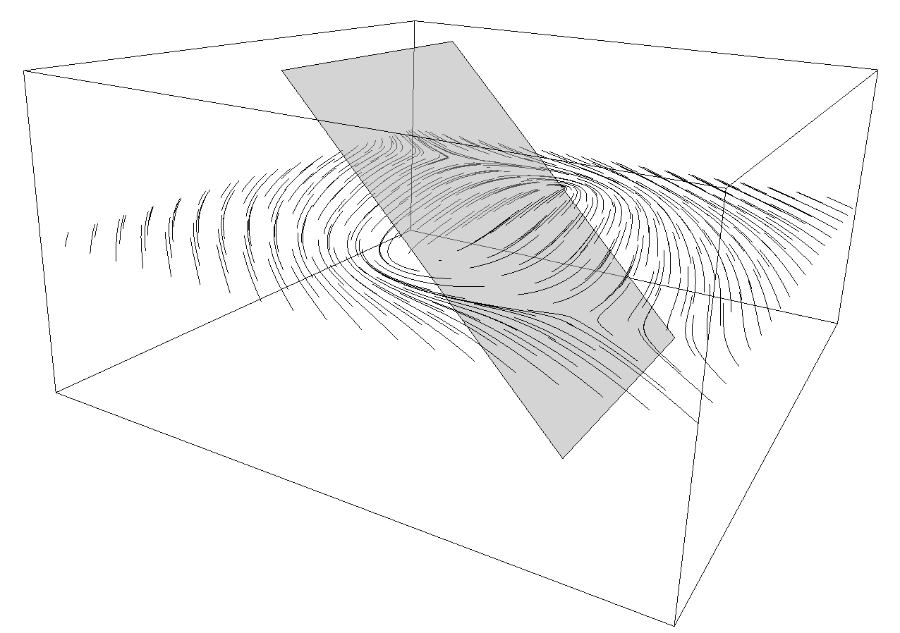

# @youwol/streamlines

Generate streamlines in various way
- on a regular 2D grid
- with dynamic generation based on a field function in 3D
- on a 3D triangulated surface (still in dev)

## Documentation
See the [generated](https://youwol.github.io/streamlines/dist/docs/modules.html) documentation.
